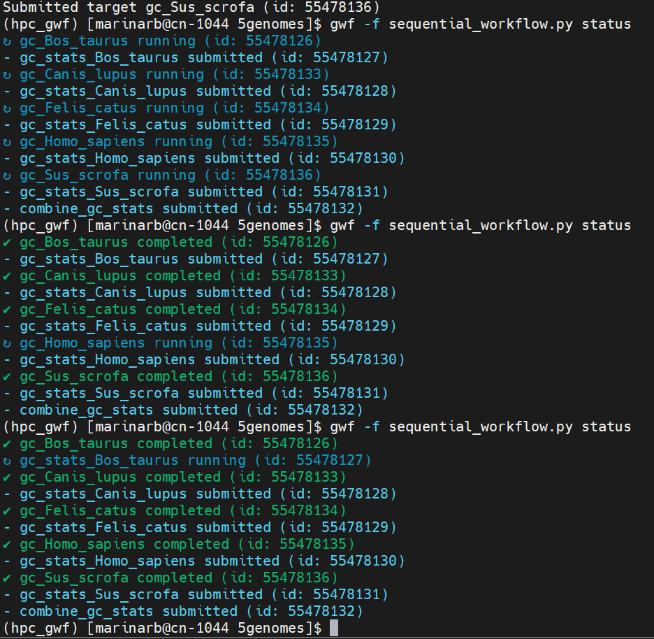
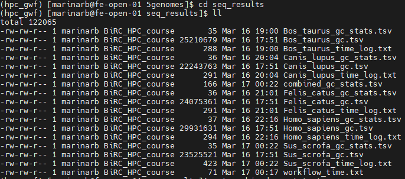
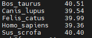
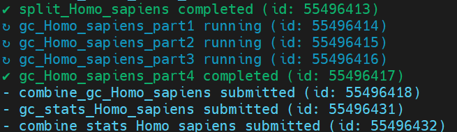
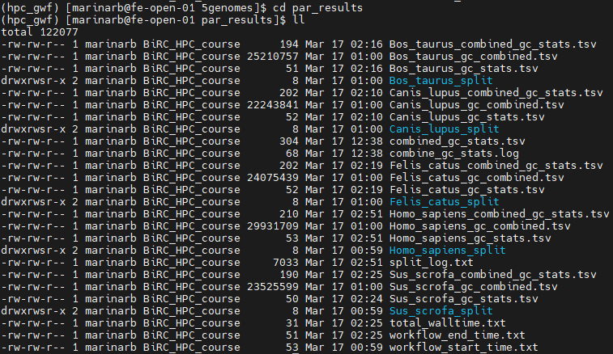
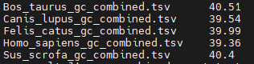
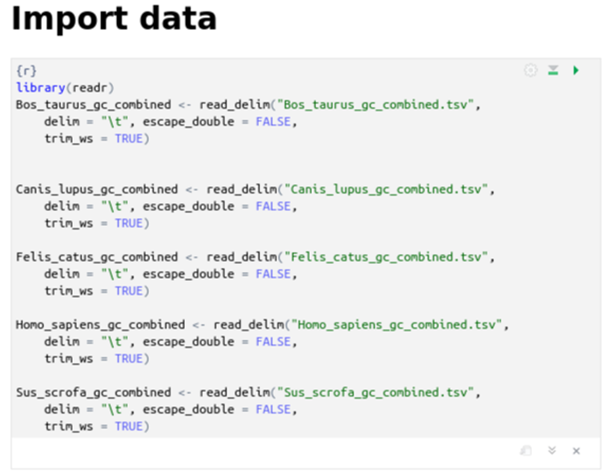
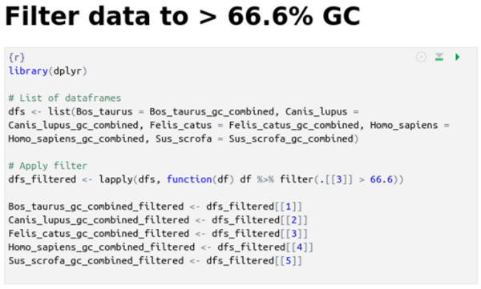
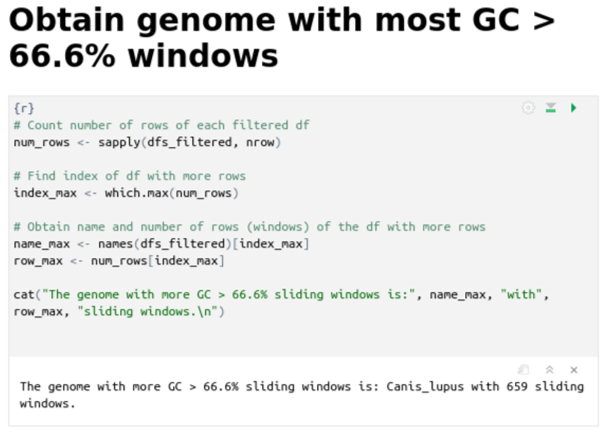

# Project description

The project aims to analyze the given genomes (in .fasta format) of 5 species (*Homo sapiens, Bos taurus, Sus scrofa domesticus, Canis lupus familiaris,* and *Felis catus*) using the tool *Seqkit* and implementing workflows working on *GenomeDK* cluster.

The main goal is to provide answers to the following questions:

-   **Question 1:** Which species has the highest median GC?

-   **Question 2:** If we assume that only GC% \> 2/3 (66.6%) can be potentially damaged by a chemical, which species is most at risk?

To accomplish the goal, we implemented a serial and a parallel workflow using GWF and examined how these workflows work. We worked under a Conda environment named *hpc_gwf,* which contains GWF and *Seqkit* tools.

# Serial workflow - *sequential_workflow.py*

## Description

To analyze the data using the *sequential_workflow.py,* we loop through each .fasta file and perform, sequentially, the following defined tasks (targets):

-   Task 1: Calculate GC content for each genome using sliding window size of 25000 with step size 5000, ignoring windows with Ns.

-   Task 2: Calculate the overall GC median using a bash script named ***calculate_gc_stats.sh*** (view code on the next section).

-   Task 3: Combine all the output files generated on Task 2 into a one .tsv file that will contain the GC median for each species.

To ensure that all tasks occur sequentially and is not possible to analyze genomes in parallel, we established dependencies between tasks, in a way that the next task will not run until the previous task has finished for all the genomes.

## Implementation

1.  Create a working directory with the genomes files and activate conda environment

    ```{bash, echo=TRUE, eval=FALSE}
    mkdir week06 # Create working directory

    cp -r /faststorage/project/BiRC_HPC_course/data/5genomes/ /faststorage/project/BiRC_HPC_course/people/marinarb/week06 # Get genomes data

    conda activate hpc_gwf # Activate conda environment
    ```

2.  Rename .fasta files (optional; just to make it easier to work with them)

    ```{bash, echo=TRUE, eval=FALSE}
    mv oldname newname
    ```

3.  Create a new directory inside the working directory to storage results of the analysis

    ```{bash, echo=TRUE, eval=FALSE}

    mkdir */week06/5genomes/seq_results
    ```

4.  Create ***sequential_workflow.py script***

    ```{python, echo=TRUE, eval=FALSE}

    import os
    import time
    from gwf import Workflow

    #######################################
    #
    # GWF workflow to analyze genomes
    #
    # How to run:
    # conda config --append channels gfworg
    # conda create -n gwf -y gwf
    # conda activate gwf
    # gwf -f 04.workflow_gwf.py status
    #
    #######################################

    # Create workflow and indicate resources
    gwf = Workflow(defaults={'nodes': 1, 'queue': "normal", 'account': "BiRC_HPC_course"})

    # Define output and input directories
    input_dir = "/faststorage/project/BiRC_HPC_course/people/marinarb/week06/5genomes"
    output_dir = "/faststorage/project/BiRC_HPC_course/people/marinarb/week06/5genomes/seq_results"
    stats_dir = "/faststorage/project/BiRC_HPC_course/people/marinarb/week06/5genomes/seq_results"
    log_dir = "/faststorage/project/BiRC_HPC_course/people/marinarb/week06/5genomes/seq_results"

    # Obtain input files (FASTA)
    fasta_files = sorted([f for f in os.listdir(input_dir) if f.endswith(".fasta")])

    # Variable to track the previous task (for sequential execution)
    prev_task = None

    # Log the start time of the entire workflow
    start_time = time.time()

    # List to store all stats files generated in second task
    stats_files = []

    # Loop through each FASTA file
    for fasta in fasta_files:
        # Extract file name without the file extension
        species_name = os.path.splitext(fasta)[0]

        # Define variables using input (FASTA file) and output (GC content and stats) file paths
        infile = f"{input_dir}/{fasta}"  # Input file path
        outfile = f"{output_dir}/{species_name}_gc.tsv"  # Output file path for GC content
        statsfile = f"{stats_dir}/{species_name}_gc_stats.tsv"  # Output file path for statistics
        combined_stats_file = f"{stats_dir}/combined_gc_stats.tsv"
        log_file = f"{log_dir}/{species_name}_time_log.txt"  # Log file to store time information

        # Task 1: Calculate GC content for each window using seqkit
        task = gwf.target(
            name=f"gc_{species_name}",  # Task name 
            inputs=[infile],  # Input file (FASTA)
            outputs=[outfile],  # Output file (GC content per window)
            walltime="02:00:00",  
            memory="16g", 
            cores=1  
        ) << f"""
        echo "Starting GC calculation for {species_name} at $(date)" >> {log_file}  # Log start time
        source $(conda info --base)/etc/profile.d/conda.sh
        conda activate hpc_gwf # Activate conda environment
        mkdir -p {output_dir}  # Create the output directory 
        # Calculate GC content for 25,000 base windows with a 5,000 base step
        time (cat {infile} | seqkit sliding -W 25000 -s 5000 | seqkit fx2tab -n -H -l -C N -g -G > {outfile}) &> {log_file}
        echo "Finished GC calculation for {species_name} at $(date)" >> {log_file}  # Log end time
        """

        # Task 2: Calculate GC median using bash script calculate_gc_stats.sh
        stats_task = gwf.target(
            name=f"gc_stats_{species_name}", 
            inputs=[outfile],  # Input GC content file
            outputs=[statsfile],  # Output file for GC statistics
            walltime="03:00:00",  
            memory="4g", 
            cores=1  
        ) << f"""
        echo "Starting GC statistics calculation for {species_name} at $(date)" >> {log_file}
        source $(conda info --base)/etc/profile.d/conda.sh
        conda activate hpc_gwf # Activate conda environment
        # Execute bash script
        bash calculate_gc_stats.sh {outfile} {statsfile}
        echo "Finished GC statistics calculation for {species_name} at $(date)" >> {log_file}
        """

        # Ensure that the statistics task only runs after the GC task
        if prev_task:
            stats_task.inputs = [prev_task.outputs[0]]  # stats_task depends on the previous task's output

        # Update the previous task to be the current stats task
        prev_task = stats_task

        # Collect stats files for final merge
        stats_files.append(statsfile)

    # Task 3: Combine all GC stats into one file
    combine_task = gwf.target(
        name="combine_gc_stats",  # Give the combine task a unique name
        inputs=stats_files,  # Inputs will be the outputs from all stats tasks
        outputs=[combined_stats_file],
        walltime="00:20:00",
        memory="1g",
        cores=1
    ) << f"""
    echo "Starting the combination of GC stats at $(date)" >> {log_file}
    echo -e "Species\tGlobal_GC\tAverage_GC\tMedian_GC" > {combined_stats_file}
    # Loop through all stats files and append their contents to the combined stats file
    for file in {' '.join(stats_files)}; do
        species=$(basename $file _gc_stats.tsv)  # Extract species name from the filename
        tail -n +2 $file | sed "s/^/$species\t/" >> {combined_stats_file}  # Add species name as a new column
    done
    echo "Finished combining GC stats at $(date)" >> {log_file}
    """

    # Ensure the combination task runs only after all stats tasks
    if prev_task:
        combine_task.inputs = [prev_task.outputs[0]]  # Combine task depends on the last stats task

    # Log the end time of the entire workflow
    end_time = time.time()

    # Calculate the total wall time taken by the entire workflow
    total_wall_time = end_time - start_time

    # Output the total wall time to a file
    with open("workflow_time.txt", "w") as f:
        f.write(f"Total wall time for the entire workflow: {total_wall_time} seconds\n")


    ```

5.  Create ***calculate_gc_stats.sh*** script (needed to perform task 2) inside the working directory (\*/week06/5genomes)

    ```{bash, echo=TRUE, eval=FALSE}
    #!/bin/bash
    # Verify arguments
    if [ "$#" -ne 2 ]; then
        echo "Usage: $0 <tsv_file> <output_stats>"
        exit 1
    fi

    # Define input and output files
    infile="$1"
    statsfile="$2"

    # Initialize variables
    total_gc=0
    total_bases=0
    first_line=1

    # Read the file line by line
    while read -r line; do
        # Skip the header
        if [[ $first_line -eq 1 ]]; then
    	    first_line=0
            continue
        fi
        # Extract GC content and length from the file
        gc=$(echo $line | awk '{print $3}')  # Third column is GC
        length=$(echo $line | awk '{print $2}')  # Second column is length

        # Calculate GC bases for this window
        gc_bases=$(echo "$gc * $length / 100" | bc)

        # Add to total GC and length variables
        total_gc=$(echo "$total_gc + $gc_bases" | bc)
        total_bases=$(echo "$total_bases + $length" | bc)
    done < "$infile"

    # Calculate global GC content
    global_gc=$(echo "scale=4; $total_gc / $total_bases * 100" | bc)

    # Calculate GC median with `awk`
    median_gc=$(awk 'BEGIN{n=0} {a[n++]=$3} END{if (n%2==1) print a[int(n/2)]; else print (a[n/2-1]+a[n/2])/2}' "$infile")

    # Save results
    echo -e "Species\tGlobal_GC\tMedian_GC" > "$statsfile"
    echo -e "$(basename "$infile" _gc.tsv)\t$global_gc\t$median_gc" >> "$statsfile"

    echo "Global GC calculated: $global_gc"

    ```

<!-- -->

6.  Start interactive job and run workflow

    ```{bash, echo=TRUE, eval=FALSE}

    srun -c 5 --mem=16g -t 03:00:00 --pty bash

    gwf -f sequential_workflow.py run
    ```

It is possible to observe that all the tasks are perform sequentially, and the next task doesn't start until the previous one has finished for all the files:

{width="496"}

Results:

{width="497"}

GC median:



## Questions about the workflow

> Why is it a serial workflow?

-   **It does not run tasks in parallel**:

    -   Each FASTA file is processed **one at a time**.

    -   The second task (`gc_stats_{species_name}`) only runs after the first one (`gc_{species_name}`) has finished.

    -   The final task (`combine_gc_stats`) only starts after all individual statistics have been calculated.

-   **Species processing is sequential**:

    -   The variable `prev_task` is used to ensure that each GC calculation task waits for the previous task to finish before executing.
    -   This prevents multiple species from being processed at the same time.

-   **Information from all species is obtained**, but sequentially:

    -   The files are iterated one by one in a `for` loop.

    -   Each file goes through the same workflow, but without parallel execution.

> What was the total walltime of your workflow from start to finish?

**Start time**: Sunday, March 16, 2025, at 5:51:38 PM CET

**End time**: Monday, March 17, 2025, at 12:22:05 AM CET

So the time difference between both events was 390,45 minutes.

# Parallel workflow - *parallel_workflow.py*

## Description

To analyze the data using *parallel_workflow.py* we loop though each .fasta file, but in contrast with *sequential_workflow.py,* we split the files into 4 parts, which can be analyzed in parallel.

We defined the following tasks (targets):

-   Task 1: Split the genomes into 4 parts using the bash script ***split_genome.sh***. A new directory will be created inside the results directory for each species containing the different parts.

-   Task 2: Calculate GC for each part in parallel using sliding window size of 25000 with step size 5000, ignoring windows with Ns.

-   Task 3: Combine the GC analysis from each part into one file, which contains the overall analysis for the given species.

-   Task 4: Calculate the overall GC median using a bash script named ***calculate_gc_stats.sh*** (the same script used in sequential_workflow.py).

-   Task 5: Combine the files generated in Task 4.

-   Task 6: Combine all files containing GC median calculation into one file.

-   Task 7: Log the end time of the workflow.

-   Task 8: Calculate total execution time.

To ensure the correct functioning of the workflow, we established dependencies between Task 3 and 4, 4 and 5, 5 and 6, 6 and 7, and 7 and 8.

## Implementation

1.  Create a working directory with the genomes files and activate conda environment

    ```{bash, echo=TRUE, eval=FALSE}
    mkdir week06 # Create working directory

    cp -r /faststorage/project/BiRC_HPC_course/data/5genomes/ /faststorage/project/BiRC_HPC_course/people/marinarb/week06 # Get genomes data

    conda activate hpc_gwf # Activate conda environment
    ```

2.  Rename .fasta files (optional; just to make it easier to work with them)

    ```{bash, echo=TRUE, eval=FALSE}

    mv oldname newname
    ```

3.  Create a new directory inside the working directory to storage results of the analysis

    ```{bash, echo=TRUE, eval=FALSE}
    mkdir */week06/5genomes/par_results
    ```

4.  Create ***parallel_workflow.py script***

    ```{python, echo=TRUE, eval=FALSE}

    import os
    from gwf import Workflow

    # Create the workflow
    gwf = Workflow(defaults={'nodes': 1, 'queue': "normal", 'account': "BiRC_HPC_course"})

    # Directories
    input_dir = "/faststorage/project/BiRC_HPC_course/people/marinarb/week06/5genomes"
    output_dir = "/faststorage/project/BiRC_HPC_course/people/marinarb/week06/5genomes/par_results"
    log_dir = "/faststorage/project/BiRC_HPC_course/people/marinarb/week06/5genomes/par_results"
    N_PARTS = 4  # Number of parts

    # List FASTA files in the input directory
    fasta_files = sorted([f for f in os.listdir(input_dir) if f.endswith(".fasta")])

    # Create the necessary directories if they don't exist
    os.makedirs(output_dir, exist_ok=True)
    os.makedirs(log_dir, exist_ok=True)

    # Log
    log_file = f"{log_dir}/split_log.txt"

    # Task 0: Log the start of the workflow
    start_time_file = f"{log_dir}/workflow_start_time.txt"

    start_task = gwf.target(
        name="workflow_start_time",
        inputs=[],
        outputs=[start_time_file],
        walltime="00:01:00",
        memory="1g",
        cores=1
    ) << f"""
    echo "Starting workflow at $(date)" > {start_time_file}
    """

    # Iterate over the FASTA files
    for fasta_file in fasta_files:
        species_name = os.path.splitext(fasta_file)[0]  # Use the file name as the species name
        split_dir = f"{output_dir}/{species_name}_split"
        combined_gc_file = f"{output_dir}/{species_name}_gc_combined.tsv"
        stats_file = f"{output_dir}/{species_name}_gc_stats.tsv"
           
        # Create subdirectory for splitting files
        os.makedirs(split_dir, exist_ok=True)

        # Task 1: Split the genome into N parts
        split_task = gwf.target(
            name=f"split_{species_name}",
            inputs=[f"{input_dir}/{fasta_file}"],
            outputs=[f"{split_dir}/{species_name}.part_{str(i).zfill(3)}.fasta" for i in range(1, N_PARTS + 1)],
            walltime="01:00:00",
            memory="16g",
            cores=7
        ) << f"""
        echo "Starting split for {species_name} at $(date)" >> {log_file}
        source $(conda info --base)/etc/profile.d/conda.sh
        conda activate hpc_gwf
        bash split_genome.sh {input_dir}/{fasta_file} {split_dir} {N_PARTS}
        echo "Split finished for {species_name} at $(date)" >> {log_file}
        """

        # Tasks 2: Calculate GC for each part in parallel
        part_outputs = []
        for i in range(1, N_PARTS + 1):
            part_file = f"{split_dir}/{species_name}.part_{str(i).zfill(3)}.fasta"
            part_gc_file = f"{split_dir}/{species_name}.part_{str(i).zfill(3)}_gc.tsv"
            part_outputs.append(part_gc_file)
            combined_gc_stats_file = f"{output_dir}/{species_name}_gc_stats_combined.tsv"

            # Task to calculate GC content for each part
            part_gc_task = gwf.target(
                name=f"gc_{species_name}_part{i}",
                inputs=[f"{split_dir}/{species_name}.part_{str(i).zfill(3)}.fasta"],  # Depends on the split parts
                outputs=[part_gc_file],
                walltime="12:00:00",
                memory="16g",
                cores=7
            ) << f"""
            echo "Starting GC calculation for {species_name} part {i} at $(date)" >> {log_file}
            source $(conda info --base)/etc/profile.d/conda.sh
            conda activate hpc_gwf
            time (cat {part_file} | seqkit sliding -W 25000 -s 5000 | seqkit fx2tab -n -H -l -C N -g -G > {part_gc_file}) &>> {log_file}
            echo "GC calculation finished for {species_name} part {i} at $(date)" >> {log_file}
            """
        
        # Task 3: Combine the GC analysis from each part
        combine_task = gwf.target(
            name=f"combine_gc_{species_name}",
            inputs=part_outputs,  # These are the output files from task 2 (GC parts)
            outputs=[combined_gc_file],  # The combined file
            walltime="05:00:00",
            memory="16g",
            cores=7
        ) << f"""
        echo "Combining GC results for {species_name} at $(date)" >> {log_file}
        cat {' '.join(part_outputs)} > {combined_gc_file}  # Combines the GC files
        echo "Combining GC results finished for {species_name} at $(date)" >> {log_file}
        """
        
        # Task 4: Calculate GC statistics on the combined file
        gc_stats_task = gwf.target(
            name=f"gc_stats_{species_name}",
            inputs=[combined_gc_file],  # The combined GC file
            outputs=[stats_file],  # The GC statistics file
            walltime="03:00:00",
            memory="16g",
            cores=7
        ) << f"""
        echo "Starting GC statistics calculation for {species_name} at $(date)" >> {log_file}
        source $(conda info --base)/etc/profile.d/conda.sh
        conda activate hpc_gwf
        bash calculate_gc_stats.sh {combined_gc_file} {stats_file}
        echo "GC statistics calculation finished for {species_name} at $(date)" >> {log_file}
        """
        
        # Task 5: Combine GC statistics
        stats_files = [stats_file for _ in range(1, N_PARTS + 1)]  # Statistics files generated in task 4
        combined_stats_file = f"{output_dir}/{species_name}_combined_gc_stats.tsv"  # Final combined stats file

        combine_stats_task = gwf.target(
            name=f"combine_stats_{species_name}",
            inputs=stats_files,  # These are the generated statistics files
            outputs=[combined_stats_file],  # The final combined file
            walltime="05:00:00",
            memory="16g",
            cores=7
        ) << f"""
        echo "Combining GC statistics at $(date)" >> {log_file}
        echo -e "Species\tMedian_GC" > {combined_stats_file}
        for file in {' '.join(stats_files)}; do
            species=$(basename $file _gc_stats.tsv)
            tail -n +2 $file | sed "s/^/$species\t/" >> {combined_stats_file}
        done
        echo "Combining GC statistics finished at $(date)" >> {log_file}
        """

    # Task 6: Combine all files into one
    all_combined_gc_stats_file = f"{output_dir}/all_combined_gc_stats.tsv"

    combine_all_task = gwf.target(
        name="combine_all_gc_stats",
        inputs=[f"{output_dir}/{species_name}_combined_gc_stats.tsv" for species_name in [os.path.splitext(f)[0] for f in fasta_files]],  # All the combined files by species
        outputs=[all_combined_gc_stats_file],  # The final combined file
        walltime="05:00:00",
        memory="16g",
        cores=7
    ) << f"""
    echo "Combining all GC files into one at $(date)" >> {log_file}
    echo -e "Species\tMedian_GC" > {all_combined_gc_stats_file}
    for file in {' '.join([f"{output_dir}/{os.path.splitext(f)[0]}_combined_gc_stats.tsv" for f in fasta_files])}; do
        species=$(basename $file _combined_gc_stats.tsv)
        tail -n +2 $file | sed "s/^/$species\t/" >> {all_combined_gc_stats_file}
    done
    echo "Combining all GC files finished at $(date)" >> {log_file}
    """

    # Task 7: Log the end time of the workflow
    end_time_file = f"{log_dir}/workflow_end_time.txt"

    end_task = gwf.target(
        name="workflow_end_time",
        inputs=[all_combined_gc_stats_file],  # The combined stats file should be the last one
        outputs=[end_time_file],
        walltime="00:01:00",
        memory="1g",
        cores=1
    ) << f"""
    echo "Ending workflow at $(date)" > {end_time_file}
    """

    # Task 8: Calculate total execution time
    total_walltime_file = f"{log_dir}/total_walltime.txt"

    total_time_task = gwf.target(
        name="total_walltime",
        inputs=[start_time_file, end_time_file],
        outputs=[total_walltime_file],
        walltime="00:01:00",
        memory="1g",
        cores=1
    ) << f"""
    start_time=$(cat {start_time_file})
    end_time=$(cat {end_time_file})
    total_time=$(echo "$end_time - $start_time" | bc)
    echo "Total execution time: $total_time seconds" > {total_walltime_file}
    """
    ```

5.  Create ***split_genome.sh*** script (needed to perform task 1) inside the working directory (\*/week06/5genomes)

    ```{bash, echo=TRUE, eval=FALSE}

    #!/bin/bash

    # Check that an input file has been provided
    if [ "$#" -ne 3 ]; then
        echo "Usage: $0 <fasta_file> <output_directory> <number_of_parts>"
        exit 1
    fi

    fasta_file="$1"
    output_dir="$2"
    num_parts="$3"

    # Create the output directory if it doesn't exist
    mkdir -p "$output_dir"

    # Split the FASTA file into parts
    seqkit split -p "$num_parts" -O "$output_dir" "$fasta_file"


    # The files will be in the format TEST.part_001.fasta, TEST.part_002.fasta, etc.

    ```

6.  Create ***calculate_gc_stats.sh*** script (needed to perform task 4) inside the working directory (\*/week06/5genomes)

    ```{bash, echo=TRUE, eval=FALSE}

    #!/bin/bash
    # Verify arguments
    if [ "$#" -ne 2 ]; then
        echo "Usage: $0 <tsv_file> <output_stats>"
        exit 1
    fi

    # Define input and output files
    infile="$1"
    statsfile="$2"

    # Initialize variables
    total_gc=0
    total_bases=0
    first_line=1

    # Read the file line by line
    while read -r line; do
        # Skip the header
        if [[ $first_line -eq 1 ]]; then
    	    first_line=0
            continue
        fi
        # Extract GC content and length from the file
        gc=$(echo $line | awk '{print $3}')  # Third column is GC
        length=$(echo $line | awk '{print $2}')  # Second column is length

        # Calculate GC bases for this window
        gc_bases=$(echo "$gc * $length / 100" | bc)

        # Add to total GC and length variables
        total_gc=$(echo "$total_gc + $gc_bases" | bc)
        total_bases=$(echo "$total_bases + $length" | bc)
    done < "$infile"

    # Calculate global GC content
    global_gc=$(echo "scale=4; $total_gc / $total_bases * 100" | bc)

    # Calculate GC median with `awk`
    median_gc=$(awk 'BEGIN{n=0} {a[n++]=$3} END{if (n%2==1) print a[int(n/2)]; else print (a[n/2-1]+a[n/2])/2}' "$infile")

    # Save results
    echo -e "Species\tGlobal_GC\tMedian_GC" > "$statsfile"
    echo -e "$(basename "$infile" _gc.tsv)\t$global_gc\t$median_gc" >> "$statsfile"

    echo "Global GC calculated: $global_gc"

    ```

7.  Start interactive job and run workflow

    ```{bash, echo=TRUE, eval=FALSE}

    srun -c 5 --mem=16g -t 03:00:00 --pty bash

    gwf -f parallel_workflow.py run
    ```

It is possible to observe that the analysis of the different parts of each genome will run in parallel:



Results:



GC median:

{width="226"}

## Questions about the workflow

> Why it is a parallel workflow? How did you parallelize the task?

This workflow is a parallel workflow for several reasons:

1.  **Data Division**: The workflow divides the data into smaller parts and processes them in parallel.
2.  **Parallel Task Execution**: Task 2 (GC calculation for each part) is designed to run in parallel, as each part of the genome is processed independently. The GC calculation is done for each part of the genome (split into multiple parts) simultaneously, utilizing separate resources for each.
3.  **Multiple Independent Tasks**: Tasks 2 and 3 (GC calculation and combination) can run independently for each part of the genome. This allows parallel execution on different parts without dependency between them.

> What was the total walltime of your workflow from start to finish?

**Start time**: Mon Mar 17 12:59:14 AM CET 2025

**End time**: Mon Mar 17 02:25:15 AM CET 2025

The workflow took 86 minutes.

# Suggested questions

> Which solution do you prefer to analyze all genomes?

The workflow that used parallelization proved to be more efficient, as it completed the task in a significantly shorter time compared to the serial workflow.

> Question 1: Which group has the highest median GC?

*Bos taurus* was the species with the highest median (40,51)


> Question 2: If we assume that only GC% \> 2/3 (66.6%) can be potentially damaged by a chemical, which species is most at risk?

*Canis lupus*, which was 659 sliding windows with GC% \> 66,6%.






